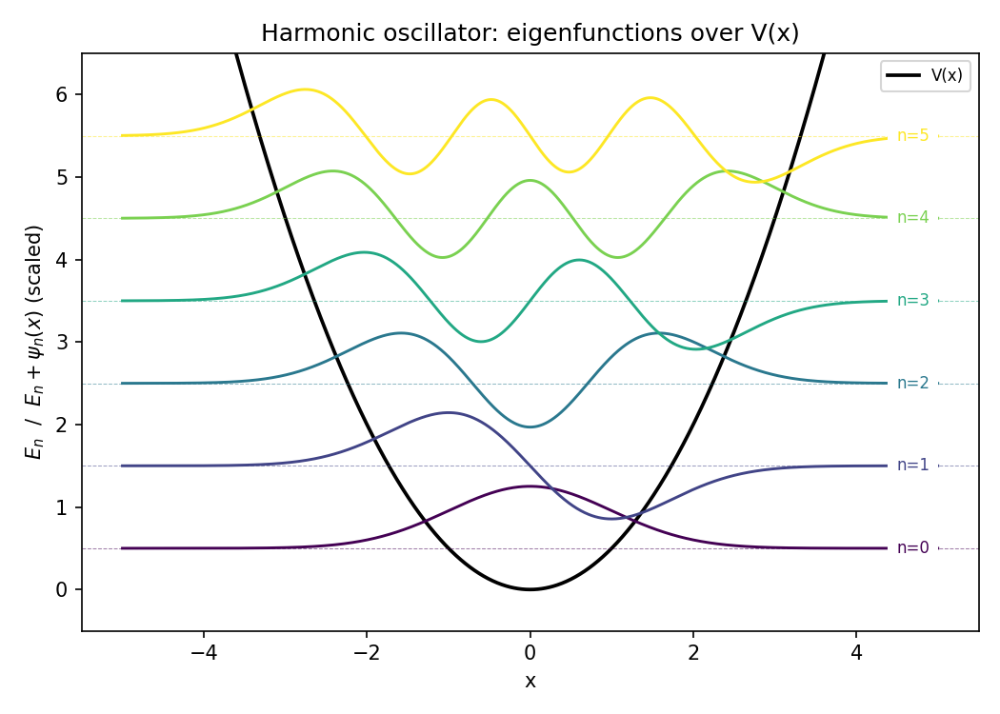
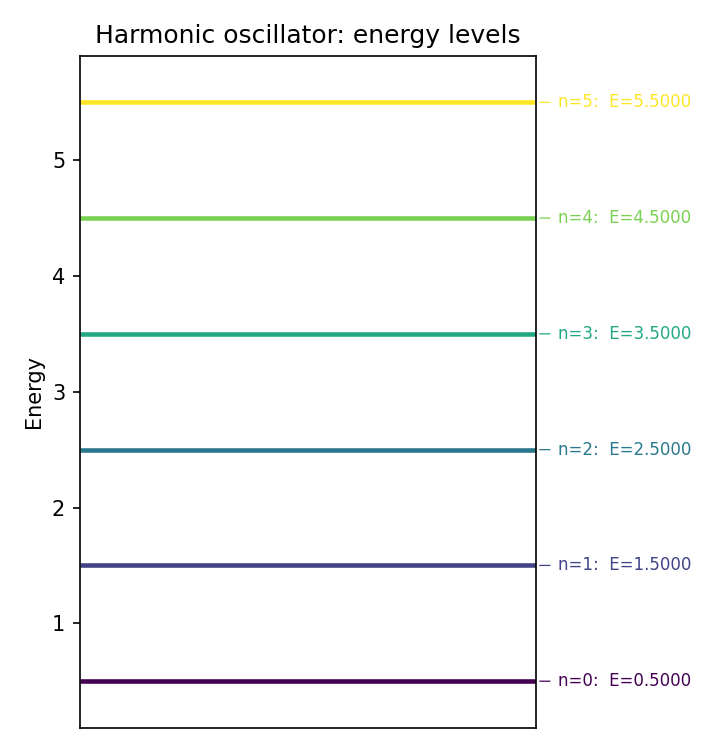
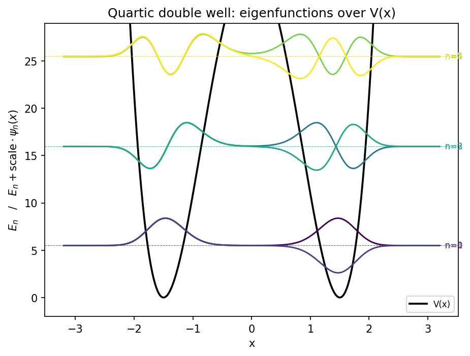
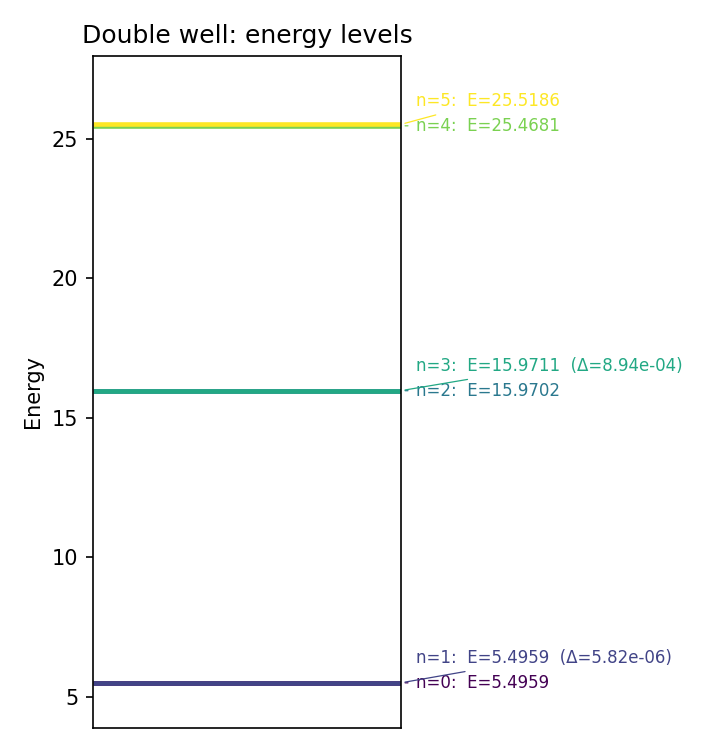
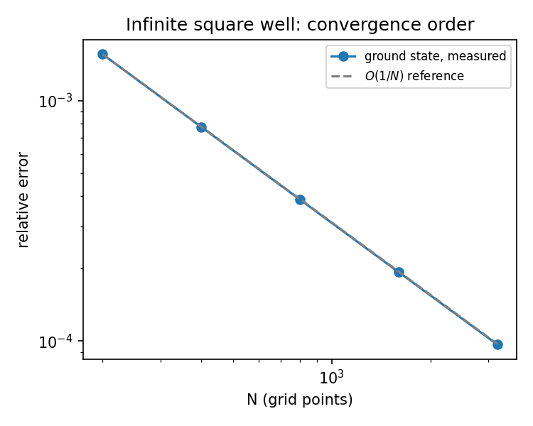

# Eigensolver 1D

This is an eigensolver for the time-independent Schrodinger equation in one dimension, built with finite differences. The idea is simple: I discretize space on a grid, build the Hamiltonian as a matrix (kinetic energy via a 5-point stencil for the second derivative, plus potential energy as a diagonal matrix), and diagonalize with `scipy.sparse.linalg.eigsh` to get the lowest eigenvalues (energies) and eigenvectors (wavefunctions). None of this is new in the sense that it's the standard finite-difference approach to solving Schrodinger, but I built and derived it myself from scratch, including the second-derivative stencil, so I'd actually understand what's happening at each step before leaning on scipy as a black box.

I wrote it to explore potentials that don't have a clean analytic solution, and to have something I could check numerically against the ones I do know by heart: the infinite square well and the harmonic oscillator. The code supports 9 potentials (harmonic oscillator, anharmonic oscillator, infinite square well, finite square well, linear potential, softened 1D Coulomb, single quartic well, discrete Dirac delta, and quartic double well), all defined in `Eigensolver_1Dimension.py` alongside the `Schrodinger_solver` function that does the heavy lifting. The full derivation of the finite-difference stencil and the analytic spectrum for each potential is in `Eigensolver_1Dimensional.pdf`, which is my handwritten notes from when I first put this together.

## Harmonic oscillator

The obligatory test case: quadratic potential, exactly evenly spaced spectrum, $E_n = \hbar\omega(n+\tfrac12)$. Here are the first six eigenfunctions, each shifted vertically to its own energy and superimposed on $V(x)$:



And the corresponding level diagram:



## Quartic double well

This is the case I actually enjoy showing, because it has no closed-form solution and it displays something physically interesting: $V(x) = V_0(x^2-a^2)^2$ has two minima, and each level of the individual well splits into a nearly degenerate pair through tunneling across the central barrier. The lower the pair sits relative to the barrier, the smaller the splitting.





With $a=1.5$ and $V_0=7$, the ground pair ($n=0,1$) splits by only $5.8\times10^{-6}$, while the second pair ($n=2,3$), sitting higher and closer to the barrier, splits by $8.9\times10^{-4}$. Exactly what you'd expect from tunneling: the more energy a state has relative to the barrier, the easier it crosses, and the bigger the splitting.

## Validation against analytic solutions

For the infinite square well ($L=10$, $\hbar=m=1$, $E_n = n^2\pi^2\hbar^2/2mL^2$) and the harmonic oscillator ($\omega=m=\hbar=1$, $E_n=\hbar\omega(n+\tfrac12)$) I compared the numerical eigenvalues against the analytic ones:

```
Infinite square well (N=2000)             Harmonic oscillator (N=2000)
 n     numeric     analytic   rel.err      n     numeric     analytic   rel.err
 1   0.04935566  0.04934802  1.548e-04     0   0.50000000  0.50000000  8.623e-11
 2   0.19742264  0.19739209  1.548e-04     1   1.50000000  1.50000000  1.995e-10
 3   0.44420095  0.44413220  1.548e-04     2   2.50000000  2.50000000  4.267e-10
 4   0.78969057  0.78956835  1.548e-04     3   3.50000000  3.50000000  7.696e-10
 5   1.23389152  1.23370055  1.548e-04     4   4.49999999  4.50000000  1.225e-09
 6   1.77680378  1.77652879  1.548e-04     5   5.49999999  5.50000000  1.796e-09
```

The harmonic oscillator gives a relative error of 9 to 10 orders of magnitude, basically machine precision. The infinite square well plateaus at ~$1.5\times10^{-4}$ across every level, a flat error that doesn't grow with $n$. That flatness has a concrete explanation, it isn't noise: it comes from a deliberate design decision I made when building the stencil, and it's worth walking through because it's the most interesting part of the project numerically.

## The boundary accuracy limit, and why I left it that way

The 5-point stencil for the second derivative is fourth order in the interior of the grid. But in the two rows adjacent to each Dirichlet boundary, the full stencil needs a point one step past the edge of the domain, a point that doesn't exist. I derived the correct one-sided formulas for those rows by hand, they're on page 2 of `Eigensolver_1Dimensional.pdf`. The problem is that if I use them there and keep the central stencil everywhere else, the Hamiltonian matrix stops being symmetric: the coefficient a one-sided row assigns to its neighbor doesn't match the coefficient that neighbor, using the central stencil, assigns back. That breaks $H=H^\dagger$, and with it the guarantee of real eigenvalues and orthogonal eigenvectors that is literally the point of solving a Hermitian eigenvalue problem.

So I kept the uniform central stencil across the whole grid, exactly as I justified in my original notes. The cost is that those two rows per boundary drop from $O(dx^4)$ to $O(dx^2)$ local accuracy, which caps the global convergence at $O(dx)$, not $O(dx^4)$, for any state with appreciable amplitude or slope at the boundary. I confirmed this by sweeping $N$ for the infinite square well:



The measured error falls exactly as $1/N$, not $1/N^4$, tracking the $O(1/N)$ reference line at every point. The harmonic oscillator doesn't show this problem because its wavefunction has already decayed to essentially zero well before reaching the domain boundary, so the defect in those two rows has almost nothing to act on. A proper fix that preserves exact symmetry exists (summation-by-parts boundary operators with a non-uniform quadrature), but that's a different can of worms and I left it out of this project on purpose.

## Two more precision notes

The boundary defect above isn't the only place this solver loses accuracy, it's just the one with the most interesting story. Two other potentials have their own, unrelated limitations, and I only found both by actually checking numeric eigenvalues against something I could compute independently.

The finite square well ($L=10$, $V_0=50$, centered) has a semi-analytic spectrum, solving the even/odd transcendental equations $k\tan(kL/2)=\kappa$ and $k\cot(kL/2)=-\kappa$ for a root-finder gives it. Against that, the solver sits at a relative error of about $8\times10^{-4}$, roughly flat across levels, and it halves when I double $N$ (2500 to 5000: $8.0\times10^{-4}\to3.9\times10^{-4}$). This isn't the boundary defect, the wavefunction has decayed to nothing long before it reaches $x_{\min}/x_{\max}$ here. It's the sharp jump in $V(x)$ at the well walls: a fixed-order finite-difference stencil doesn't resolve a discontinuity as cleanly as a smooth potential, and needs a finer grid right around $x=\pm L/2$ to do better.

The discrete delta well is worse, and for a completely different reason. The exact bound state is $E=-m\alpha^2/2\hbar^2$, for $\alpha=5$ that's $-12.5$. The solver gives $-12.146$ at $N=2000$ (2.8% off) and $-12.321$ at $N=4000$ (1.4% off), still shrinking with $N$ but starting from a much worse place than anything else in this project. The reason is that `V_DeltaDiscrete` represents an actual Dirac delta as a single grid spike, $V_{i_0}=-\alpha/dx$, and that's a genuinely coarse stand-in for a delta function. It only converges to the real thing as $dx\to0$, and it needs a much finer grid than every other potential here to get comparable accuracy. If I ever use this potential for more than illustration, this is the first thing to fix.

## What's in the repo

`Eigensolver_1Dimension.py` is the module with the solver, the 9 potentials, and the plotting functions (`plot_wavefunctions`, `plot_energy_levels`). `validate_1d.py` runs the comparison against analytic solutions and regenerates the convergence plot. `demo_figures.py` regenerates the four figures for the harmonic oscillator and the double well. `Eigensolver_1Dimension.ipynb` is the demo notebook with everything already run and the plots embedded. `Eigensolver_1Dimensional.pdf` is my handwritten derivation of the stencil and the analytic spectrum for all 9 potentials.

To run it:

```
pip install -r requirements.txt
python demo_figures.py
python validate_1d.py
```

## Scope

This is 1D only, using a low-to-mid-order finite-difference scheme and standard sparse diagonalization (no shift-invert, no acceleration for large domains). It's not meant to be a production package or to handle huge grids, it's the tool I built to understand 1D spectra and to practice the bridge between a derivation on paper and working code. The 2D version of this same approach lives in `Eigensolver_2Dimensions.py`.
