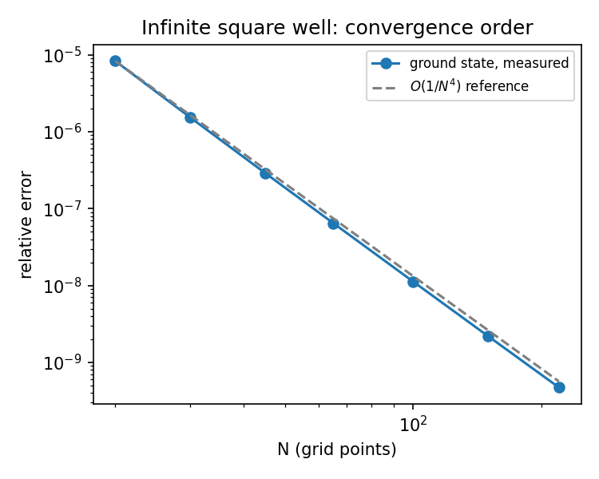
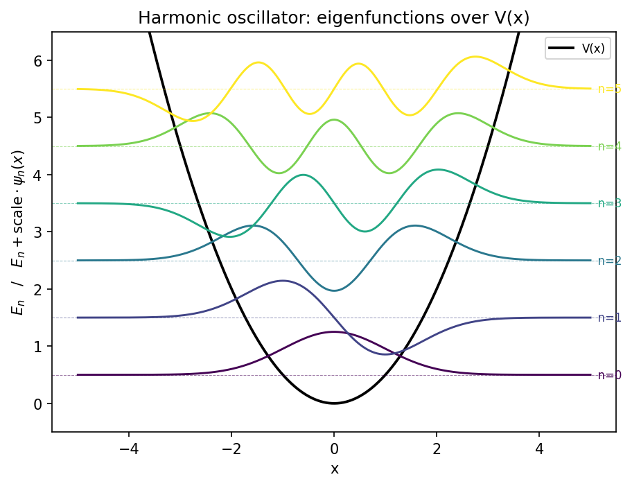
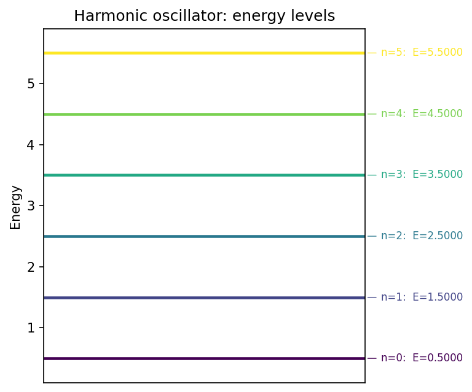
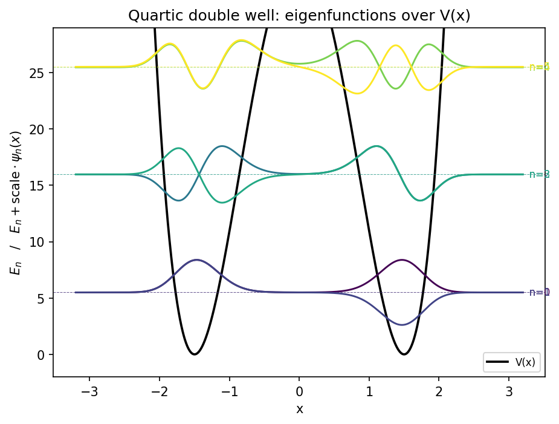
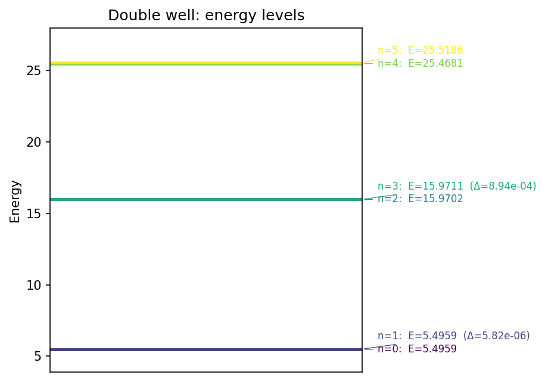

# Eigensolver 1D

[](https://github.com/Chumita003/1D_SchrodingerEigensolver/actions/workflows/tests.yml)
[](https://www.python.org/)
[](LICENSE)

**A finite-difference eigensolver for the 1D time-independent Schrodinger equation, built from scratch and validated against every analytic spectrum it can be compared to.** Space is discretized on a uniform grid, the kinetic operator is a 4th-order 5-point stencil, the potential is a diagonal matrix, and the resulting sparse Hamiltonian is diagonalized with shift-invert `eigsh`. Nine potentials, 36 regression tests, CI on Python 3.10 and 3.12.

The interesting part is not the method, which is standard. It is that building it carefully surfaced three *distinct* sources of error that look identical from the outside — all of them show up as a relative error around $10^{-3}$ to $10^{-4}$ that refuses to shrink — and separating them is what the project is actually about.

**Three results:**

**1. Fourth-order convergence, once the boundary is handled correctly.** The 5-point stencil needs a point outside the domain at each Dirichlet wall. Treating it as zero is not a boundary condition, it is a dropped term, and it capped the whole solver at $O(dx)$. Closing the stencil with the odd extension $\psi_{-1}=-\psi_1$ — which follows from the Schrodinger equation itself, not from numerical analysis — restores the design order:

$$1.5\times10^{-4} \quad\longrightarrow\quad 4\times10^{-11}, \qquad p = 1.00 \quad\longrightarrow\quad p = 4.01$$



**2. Discontinuous potentials need cell-averaged sampling, not a better stencil.** Evaluating a step potential at the grid points puts each wall at the nearest mesh point, so the well's *width* is wrong by up to $dx$. Averaging $V$ over each cell makes the encoded width exact and lifts the finite well from $p=1.04$ to $p=2.07$, a factor of 52 in absolute error. Raising the order of the kinetic operator would not have helped at all.

**3. Second order is then a hard ceiling, and I checked why rather than assuming.** At the wall $\psi''$ jumps, so $\psi$ is only $C^1$ and the stencil's Taylor expansion is invalid there. Choosing $N$ so the wall lands exactly on a cell boundary — which makes the step representation exact — does *not* reduce the error. It stays at $p=2.00$. So the survivor is the stencil crossing the kink, and no sampling scheme removes it.

---

This is an eigensolver for the time-independent Schrodinger equation in one dimension, built with finite differences. The idea is simple: I discretize space on a grid, build the Hamiltonian as a matrix (kinetic energy via a 5-point stencil for the second derivative, plus potential energy as a diagonal matrix), and diagonalize with `scipy.sparse.linalg.eigsh` to get the lowest eigenvalues (energies) and eigenvectors (wavefunctions). None of this is new in the sense that it's the standard finite-difference approach to solving Schrodinger, but I built and derived it myself from scratch, including the second-derivative stencil, so I'd actually understand what's happening at each step before leaning on scipy as a black box.

I wrote it to explore potentials that don't have a clean analytic solution, and to have something I could check numerically against the ones I do know by heart: the infinite square well and the harmonic oscillator. The code supports 9 potentials (harmonic oscillator, anharmonic oscillator, infinite square well, finite square well, linear potential, softened 1D Coulomb, single quartic well, discrete Dirac delta, and quartic double well), all defined in `Eigensolver_1Dimension.py` alongside the `Schrodinger_solver` function that does the heavy lifting. Two of them are not smooth, and those are put on the grid by cell average rather than by evaluating them at the grid points — `V_FiniteSquareWell_CellAveraged` and `V_DeltaDiscrete`. The plain `V_FiniteSquareWell` keeps the pointwise sampling so the two can be compared directly; there is a whole section below on why the difference matters. The full derivation of the finite-difference stencil and the analytic spectrum for each potential is in `Eigensolver_1Dimensional.pdf`, which is my handwritten notes from when I first put this together.

## Harmonic oscillator

The obligatory test case: quadratic potential, exactly evenly spaced spectrum, $E_n = \hbar\omega(n+\tfrac12)$. Here are the first six eigenfunctions, each shifted vertically to its own energy and superimposed on $V(x)$:



And the corresponding level diagram:



## Quartic double well

This is the case I actually enjoy showing, because it has no closed-form solution and it displays something physically interesting: $V(x) = V_0(x^2-a^2)^2$ has two minima, and each level of the individual well splits into a nearly degenerate pair through tunneling across the central barrier. The lower the pair sits relative to the barrier, the smaller the splitting.





With $a=1.5$ and $V_0=7$, the ground pair ($n=0,1$) splits by only $5.8\times10^{-6}$, while the second pair ($n=2,3$), sitting higher and closer to the barrier, splits by $8.9\times10^{-4}$. Exactly what you'd expect from tunneling: the more energy a state has relative to the barrier, the easier it crosses, and the bigger the splitting.

## Validation against analytic solutions

For the infinite square well ($L=10$, $\hbar=m=1$, $E_n = n^2\pi^2\hbar^2/2mL^2$) and the harmonic oscillator ($\omega=m=\hbar=1$, $E_n=\hbar\omega(n+\tfrac12)$) I compared the numerical eigenvalues against the analytic ones:

```
Infinite square well (N=2000)             Harmonic oscillator (N=2000)
 n     numeric     analytic   rel.err      n     numeric     analytic   rel.err
 1   0.04934802  0.04934802  4.366e-11     0   0.50000000  0.50000000  8.786e-11
 2   0.19739209  0.19739209  1.055e-11     1   1.50000000  1.50000000  2.003e-10
 3   0.44413220  0.44413220  3.830e-13     2   2.50000000  2.50000000  4.280e-10
 4   0.78956835  0.78956835  1.442e-11     3   3.50000000  3.50000000  7.699e-10
 5   1.23370055  1.23370055  4.053e-11     4   4.49999999  4.50000000  1.226e-09
 6   1.77652879  1.77652879  8.657e-11     5   5.49999999  5.50000000  1.796e-09
```

The harmonic oscillator gives a relative error of 9 to 10 orders of magnitude, basically machine precision. The infinite square well used to plateau at ~$1.5\times10^{-4}$ across every level, a flat error that didn't grow with $n$. That flatness had a concrete explanation, and chasing it down is the most interesting part of the project numerically, so the section below keeps the whole story: what the defect was, why my first instinct about how to fix it was wrong, and what the actual fix turned out to be.

## The boundary rows: the defect, the wrong fix, and the right one

The 5-point stencil for the second derivative is fourth order in the interior of the grid. But in the two rows adjacent to each Dirichlet boundary, the full stencil needs a point one step past the edge of the domain, a point that doesn't exist. Concretely, labeling the interior points $x_1\dots x_N$ with boundaries at $x_0$ and $x_{N+1}$, the row for $i=1$ is

$$\frac{-\psi_{-1} + 16\psi_0 - 30\psi_1 + 16\psi_2 - \psi_3}{12 dx^2}$$

and while $\psi_0 = 0$ is legitimate (that's the Dirichlet condition), $\psi_{-1}$ sits at $x_0 - dx$, outside the domain. Treating it as zero is not a boundary condition, it's just dropping a term.

My first instinct was to derive one-sided fourth-order formulas for those two rows by hand, they're on page 2 of `Eigensolver_1Dimensional.pdf`. That fix doesn't work, and the reason is structural: if I use them there and keep the central stencil everywhere else, the Hamiltonian matrix stops being symmetric, because the coefficient a one-sided row assigns to its neighbor doesn't match the coefficient that neighbor, using the central stencil, assigns back. That breaks $H=H^\dagger$, and with it the guarantee of real eigenvalues and orthogonal eigenvectors that is literally the point of solving a Hermitian eigenvalue problem. So for a while I kept the uniform central stencil and documented the cost: those two rows per boundary drop from $O(dx^4)$ to $O(dx^2)$ local accuracy, which caps global convergence at $O(dx)$ for any state with appreciable amplitude or slope at the boundary. The measured error fell exactly as $1/N$, confirming it.

The right fix doesn't come from numerical analysis at all, it comes from the differential equation. Since $\psi'' = \frac{2m}{\hbar^2}(V-E)\psi$ and $\psi(x_0)=0$, it follows immediately that $\psi''(x_0)=0$ too. The low-order even derivatives vanish at a Dirichlet boundary, so $\psi$ is odd about $x_0$ and

$$\psi_{-1} = -\psi_1.$$

Substituting that into the row above, the $-\psi_{-1}$ term becomes $+\psi_1$, which simply adds $+1/(12 dx^2)$ to the **diagonal** entry of that row, i.e. $-30 \to -29$ in units of $1/(12 dx^2)$. Same argument at $i=N$. Because it only touches the diagonal, the matrix stays exactly symmetric, which is precisely what the one-sided formulas couldn't manage. Two lines of code:

```python
main[0]  += 1.0 / (12.0 * dx**2)
main[-1] += 1.0 / (12.0 * dx**2)
```

The effect on the infinite square well is dramatic: the flat $1.5\times10^{-4}$ plateau drops to $\sim10^{-11}$, and the convergence order goes from $p=1.00$ to $p\approx4.0$:


```
N=   20   rel. error=8.285e-06
N=   30   rel. error=1.529e-06   local slope p=4.17
N=   45   rel. error=2.886e-07   local slope p=4.11
N=   65   rel. error=6.450e-08   local slope p=4.08
N=  100   rel. error=1.127e-08   local slope p=4.05
N=  150   rel. error=2.196e-09   local slope p=4.03
N=  220   rel. error=4.724e-10   local slope p=4.01
```

The sweep stops at $N=220$ on purpose. Past that the error flattens out around $10^{-10}$ to $10^{-12}$, where the shift-invert eigensolve, not the discretization, is the accuracy floor, so pushing to $N=3200$ would be measuring ARPACK rather than the stencil. The harmonic oscillator is unchanged either way, because its wavefunction has already decayed to essentially zero well before reaching the domain boundary, so $\psi_{-1}\approx0$ regardless.

One honest caveat: the odd extension is exact only when $V'(x_0)=0$. Differentiating $\psi''=\frac{2m}{\hbar^2}(V-E)\psi$ twice and evaluating at the boundary leaves $\psi^{(4)}(x_0) = \frac{4m}{\hbar^2}V'(x_0)\psi'(x_0)$, the first even derivative that isn't forced to vanish. With $V'(x_0)\neq0$ a local $O(dx^2)$ error survives in those two rows. In practice this doesn't bite: if $V$ has appreciable slope at the domain edge, the domain is too small to begin with.

## Two more precision notes

The boundary rows weren't the only place this solver loses accuracy, and fixing them didn't touch the other two. Both of these are potential-sampling problems, not stencil problems, and I only found them by actually checking numeric eigenvalues against something I could compute independently.

The finite square well ($L=10$, $V_0=50$, centered) has a semi-analytic spectrum, solving the even/odd transcendental equations $k\tan(kL/2)=\kappa$ and $k\cot(kL/2)=-\kappa$ for a root-finder gives it. Against that, the solver used to sit at a relative error of about $8\times10^{-4}$, roughly flat across levels, halving each time I doubled $N$, i.e. first order. This is *not* the boundary defect, and it's worth being explicit about that because the error magnitude is in the same ballpark the boundary defect used to produce: the odd-extension fix leaves these numbers completely unchanged, digit for digit. Two independent reasons it can't be the boundary: the wavefunction has decayed to nothing long before it reaches $x_{\min}/x_{\max}$ here, and the error doesn't move when the boundary rows change.

What it actually is: the sharp jump in $V(x)$ at the well walls, sampled pointwise onto the grid by `np.where`. Doing that puts the effective wall at whichever grid point happens to be nearest, so the well's width is only known to within $dx$ and the energies inherit an $O(dx)$ error. The fix is to give each grid point the *average* of $V$ over its cell instead of the value at its center,

$$V_i = \frac{1}{dx}\int_{x_i - dx/2}^{x_i + dx/2} V(x')\,dx'$$

which for a step is exact and elementary: the only cell that changes is the one straddling a wall, and it gets $V_0$ times the fraction of itself lying outside the well. That single fractional number carries the sub-grid position of the wall, which is precisely what pointwise sampling throws away. It's implemented as `V_FiniteSquareWell_CellAveraged` and measured side by side against the pointwise version in `convergence_study_finite_well`:

```
N       pointwise    p        cell-averaged  p
200     1.398e-02             2.592e-03
400     5.869e-03    1.25     4.939e-04      2.39
800     2.650e-03    1.15     1.051e-04      2.23
1600    1.254e-03    1.08     2.408e-05      2.13
3200    6.094e-04    1.04     5.754e-06      2.07
```

Order $1 \to 2$, and a factor of 52 in absolute error at $N=1600$. The mechanism is sharper than "it approximates $V$ better": the cell average makes the encoded well width **exact**. Measuring the total grid measure where $V<V_0$ against the true $L=4$ gives $10^{-14}$ at every $N$ for cell averaging, against errors of $2.0\times10^{-2}$, $4.0\times10^{-2}$, $5.0\times10^{-3}$, $1.0\times10^{-2}$ for pointwise as $N$ grows — first order, and erratic rather than monotone, because it depends on where the grid lands relative to the wall.

Second order is the ceiling, and I checked *why* rather than assuming. The obvious guess is that the residual comes from replacing the step by a constant inside the one cell that straddles the wall. If that were it, choosing $N$ so the wall falls exactly on a cell boundary would remove it. It doesn't:

| $N\approx3200$ | relative error | $p$ |
|---|---|---|
| generic grid, wall inside a cell | $5.75\times10^{-6}$ | 2.07 |
| aligned grid, wall on a cell boundary | $1.76\times10^{-5}$ | 2.00 |

Aligning makes it slightly *worse* and leaves the order at exactly 2. So the survivor is the other error: $V$ jumps and $\psi\neq0$ at the wall, so $\psi''$ jumps and $\psi$ is only $C^1$ there, while the stencil rows spanning that point expand in a Taylor series assuming four continuous derivatives. A symmetric stencil across a $C^1$ point gives second order no matter how $V$ is sampled. Getting past it would need an immersed-interface treatment that builds the jump into the stencil itself. Out of scope.

The discrete delta well is worse, and for a completely different reason. The exact bound state is $E=-m\alpha^2/2\hbar^2$, for $\alpha=5$ that's $-12.5$. The solver gives $-12.146$ at $N=2000$ (2.8% off) and $-12.321$ at $N=4000$ (1.4% off), still shrinking with $N$ but starting from a much worse place than anything else in this project. The reason is that `V_DeltaDiscrete` represents an actual Dirac delta as a single grid spike, $V_{i_0}=-\alpha/dx$, and that's a genuinely coarse stand-in for a delta function. It only converges to the real thing as $dx\to0$, and it needs a much finer grid than every other potential here to get comparable accuracy. If I ever use this potential for more than illustration, this is the first thing to fix.

## What's in the repo

`Eigensolver_1Dimension.py` is the module with the solver, the 9 potentials (10 functions, since the finite square well comes in a pointwise and a cell-averaged version), and the plotting functions (`plot_wavefunctions`, `plot_energy_levels`). `validate_1d.py` runs the comparison against analytic solutions, the two convergence studies, and regenerates the convergence plot. `demo_figures.py` regenerates the four figures for the harmonic oscillator and the double well. `Eigensolver_1Dimension.ipynb` is the demo notebook with everything already run and the plots embedded. `Eigensolver_1Dimensional.pdf` is my handwritten derivation of the stencil and the analytic spectrum for all 9 potentials.

To run it:

```
pip install -r requirements.txt
python demo_figures.py
python validate_1d.py
```

## Scope

This is 1D only, using a low-to-mid-order finite-difference scheme and sparse diagonalization with shift-invert: `eigsh` targets eigenvalues near a safe lower bound on the spectrum (`min(V) - 1`, guaranteed below every possible eigenvalue since $E_0\geq\min(V)$) instead of running plain Lanczos on the whole thing, converging faster and more robustly to the lowest few states. It's not meant to be a production package or to handle huge grids, it's the tool I built to understand 1D spectra and to practice the bridge between a derivation on paper and working code. The 2D version of this same approach lives in `Eigensolver_2Dimensions.py`.
